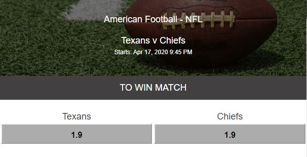
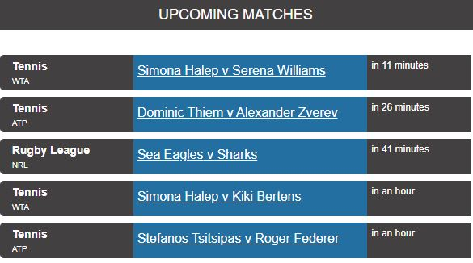
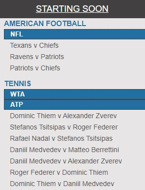
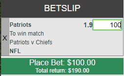
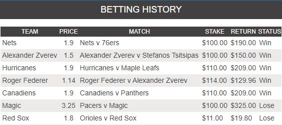
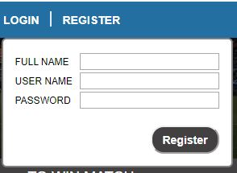
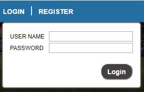

# Virtual Sportsbook
Have a bet on your favourite sports. Click to go to the [Live App](https://virtual-sportsbook.goose39dev.now.sh/)

## API Documentation
See Documentation in API repo [here](https://github.com/Goose39/virtual-sportsbook-api)

## APP Screenshots
- ### Match View

- ### Upcoming Matches

- ### Match List

- ### Bets 

- ### Payout

- ### Register

- ### Login

## Summary and Instructions
Virtual Sportsbook is an app that allows you to make bet on your favourite sports. The reponsive design supports any screen size from PC or Laptop to Tables and Mobile Phones. 
 
 
All matches are randomly generated. Matches are created every 15min with a starting time 24hrs in the future. All matches will be resulted 1min after they have started and all bets placed on those matches are settled 1min after the results have been finalized.
 
 
Users will need to register an account in order to place bets. Each new account will be loaded with $1000 in virtual currency. Once you have created an account, you will be automatically logged in and you will be ready toplace your first bet!
 
 
I order to place a bet you will need to find a match to bet on. There are two ways to do this; either by navigating through the "Match List" on the left hand side of the screen or you could click on "Upcoming Matches" on the top left to quickly navigate to the matches which are starting soon.
 
 
Once you have found your match, it will load in to the console in the center of the page. Click on the price/odd below the team you want to bet on. The bet will then load into the "Betslip" on the right.
 
 
The "Betslip" is where you will make your bet. Enter the amount that you would like to bet on your team (not more than your balance, of course!). When you are happy witht e amount you have enter and the team you have selected, click "Place Bet" at the bottom of the betslip and your bet is placed! 
 
 
To check the results of your bets simply click at top of the page to the right of your user name, on "Bet History". There you will find a list of all your previous bets.
 
 
Blown up your bankroll? Dont stress, just click the RESET BALANCE button that will appear where you balance used to be. Your account will be reloaded with another $1000.

## User Accounts
You are more than welcome to create you own betting account to place bets. Alternatively you can login with the deom account below:  
Username: Demo  
Password: Demo@1234 

## Technology
Frontend/Client was built using React and the API built with NodeJS and PostgreSQL. Want more information about the backend? Checkout the [API Documentation](https://github.com/Goose39/virtual-sportsbook-api)
